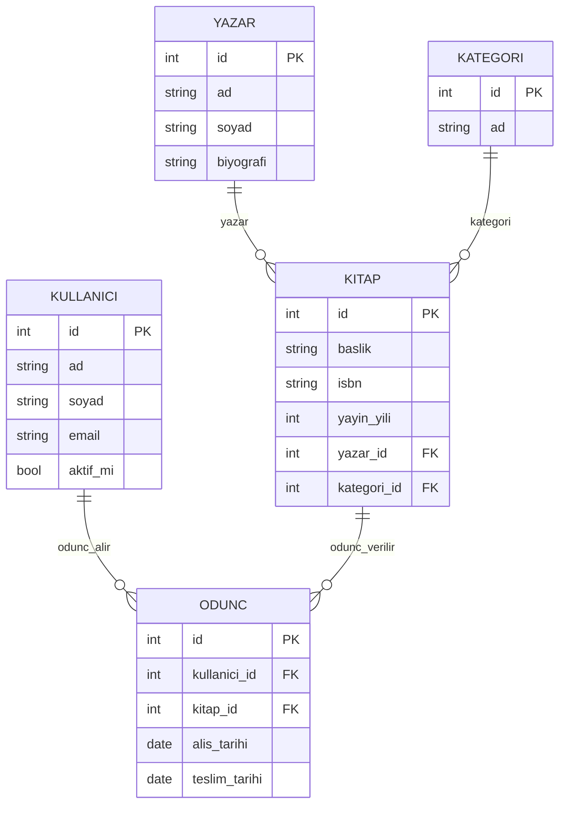

# Kütüphane Yönetim Sistemi API

Python ve FastAPI ile geliştirdiğim kütüphane yönetim sistemi projesi.

[](https://github.com/UmitKaya038/KutuphaneAPI/actions/workflows/ci.yml)
[](https://codecov.io/gh/UmitKaya038/KutuphaneAPI)

## Ne İşe Yarar?

Bu API ile kitapları, yazarları, kategorileri ve kullanıcıları yönetebiliyoruz. Ayrıca kim hangi kitabı ne zaman almış, ne zaman geri getirecek gibi ödünç işlemlerini de takip ediyor.

**Temel özellikler:**
*   Kitap, Yazar, Kategori, Kullanıcı ekleme/silme/güncelleme (CRUD).
*   Ödünç alma ve iade etme süreçleri.
*   SQLite veritabanı kullanıyor.
*   Otomatik dokümantasyonu var (Swagger UI).

## Veritabanı Tasarımı (ER Şeması)



## Kurulum

Projeyi çalıştırmak için Python kurulu olması lazım.

1.  Repoyu indirin:
    ```bash
    git clone https://github.com/UmitKaya038/KutuphaneAPI.git
    cd KutuphaneAPI
    ```

2.  Windows kullanıyorsanız direkt `run.bat` dosyasına çift tıklayın veya cmd'den çalıştırabilirsiniz.
    ```cmd
    run.bat
    ```

3.  Elle kurmak isterseniz:
    ```bash
    python -m venv venv
    venv\Scripts\activate
    pip install -r requirements.txt
    uvicorn app.main:app --reload
    ```

## Nasıl Kullanılır?

Uygulama ayağa kalkınca tarayıcıdan şuraya gidin:
[http://127.0.0.1:8000/docs](http://127.0.0.1:8000/docs)

Buradan bütün endpointleri deneyebilirsiniz.

### Örnek İstekler

**Kitap Ekleme:**
POST `/api/kitaplar/`
```json
{
  "baslik": "İnce Memed",
  "isbn": "978-975-08-0714-7",
  "yayin_yili": 1955,
  "yazar_id": 1,
  "kategori_id": 2
}
```

**Ödünç Verme:**
POST `/api/odunc/`
```json
{
  "kullanici_id": 5,
  "kitap_id": 12,
  "alis_tarihi": "2023-11-20"
}
```

## Testler

Testleri çalıştırmak isterseniz:
```bash
pytest
```
Coverage raporu için:
```bash
pytest --cov=app --cov-report=term-missing
```

## Proje Yapısı
Klasik FastAPI yapısı aslında. `app` klasöründe kodlar, `tests` klasöründe testler var.

```text
KutuphaneAPI/
├── app/
│   ├── routers/      # Endpointler (kitap, yazar vs.)
│   ├── models.py     # Veritabanı tabloları
│   ├── schemas.py    # Veri modelleri
│   ├── main.py       # Uygulamanın başladığı yer
│   └── database.py   # DB bağlantısı
├── tests/            # Testler burada
├── requirements.txt  # Kütüphaneler
└── run.bat           # Çalıştırma betiği
```
